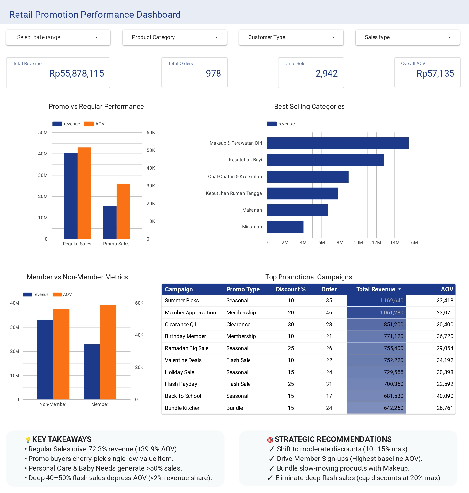

# 🛒 Retail Sales & Promotion Performance Analysis


An end-to-end data analytics project evaluating the effectiveness of retail promotional campaigns, customer purchasing behavior, Average Order Value (AOV), and category-level performance using **Google BigQuery SQL** and an interactive **Looker Studio Dashboard**.

---

## 📊 Dashboard Preview



---

## 📁 Dataset & Data Availability

All raw data, cleaned tables, and analytical output datasets used in this project are hosted and available on Kaggle:

* 📊 **Kaggle Dataset:** [Retail Sales & Promotion Performance Dataset](https://www.kaggle.com/datasets/septharie/retail_promotion)
* 🔗 **Looker Studio Dashboard:** [Interactive Dashboard Link](https://datastudio.google.com/reporting/5dc9b105-6c78-4200-8092-f68da792087f/page/gjo4F)

---

## 🎯 Executive Summary & Key Insights

* **Promotional Impact:** Promoted transactions generated higher overall revenue, but evaluating Average Order Value (AOV) highlighted key opportunities to optimize promo discount thresholds.
* **Customer Behavior:** Segmenting sales across member types revealed distinct purchasing patterns between regular and non-regular buyers.
* **Category Performance:** High-margin product categories drove the majority of campaign revenue, whereas lower-performing categories require revised promotion strategies.

---

## 🛠️ Tech Stack & Methodology

* **Data Warehouse & Data Transformation:** Google BigQuery (SQL)
  * Data Profiling, Auditing (`COUNTIF`), & Deduplication (`ROW_NUMBER()`)
  * Data Normalization & Master Data Joins (`LEFT JOIN`)
  * Aggregations & Metrics Calculation (AOV, Total Revenue, Order Volume)
* **Business Intelligence & Visualization:** Google Looker Studio
* **Version Control:** GitHub

---

## 📂 Repository Structure

```text
retail-promotion-analysis/
│
├── assets/
│   └── dashboard_preview.jpg       
│
├── sql/
│   ├── 01_cleaning/               
│   │   ├── clean_member.sql
│   │   ├── clean_product.sql
│   │   ├── clean_promo.sql
│   │   ├── clean_sales_detail.sql
│   │   ├── clean_sales_header.sql
│   │   └── clean_store.sql
│   ├── 02_summary/                 
│   │   └── sales_summary.sql
│   └── 03_analysis/                
│       ├── promo_vs_regular.sql
│       ├── customer_segmentation.sql
│       ├── category_performance.sql
│       └── campaign_roi_analysis.sql
│
├── LICENSE                         
└── README.md                       
```

---

## ⚙️ Data Pipeline Overview

1. **Data Profiling & Cleaning (`sql/01_cleaning/`):**
   * Audited `NULL` values across attributes using `COUNTIF()`.
   * Deduplicated sales transactions using `ROW_NUMBER() OVER(PARTITION BY ...)`.
   * Standardized product master data (`clean_product`) and linked cleaned promo references (`clean_promo`).

2. **Data Summary & Modeling (`sql/02_summary/`):**
   * Consolidated customer demographics, product categories, and campaign attributes into flat analytical tables for seamless BI ingestion.

3. **In-depth Analysis (`sql/03_analysis/`):**
   * Computed promo vs. non-promo revenue performance and AOV metrics.
   * Evaluated category distribution and customer purchasing segments.

---

## 📄 License

This project is licensed under the [MIT License](LICENSE).

---

## 👤 Author

**Septharie**
* 🌐 Portfolio Website: [septha.github.io](https://septha.github.io)
* 🐙 GitHub: [@septharie](https://github.com/septharie)
